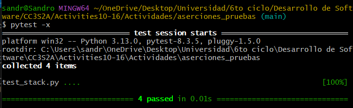

## Paso 1

La instalación de las herramientas necesarias fue hecha al momento de correr make install

## Paso 2

Luego de haber revisado los métodos de la clase Stack, se hace el pytest y se verifica que todos los tests pasan.

## Paso 3