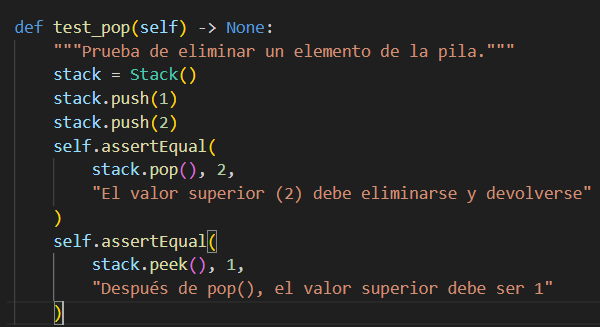

## Paso 1

La instalación de las herramientas necesarias fue hecha al momento de correr make install

## Paso 2

Luego de haber revisado los métodos de la clase Stack, se hace el pytest y se verifica que todos los tests pasan.

Además, se pueden correr tests en orden aleatorio usando un plugin llamado pytest-randomly.

## Paso 3

Se verifica el método test_is_empty() y se añade otro llamado test_pop2()

## Paso 4

Se corre el pytest para verificar que funciona correctamente

## Paso 5

Se cambia el método para testear la operación peek()

## Paso 6

Se usa el método test_pop() para verificar que la operación pop funciona correctamente

## Paso 7 

Se reemplaza el método test_push() para haberlo verificado de dos maneras distintas

## Paso 8
Se comprueba que con los nuevos métodos el pytest pasa

## Paso 9 

Se corre el comando pytest usando pytest-cov para verificar cobertura

