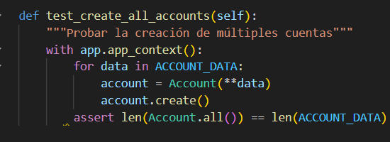

Paso 1:

Se verifica que está inicializada la base de datos.

Se corre pytest y se verifica que hay errores que deben de corregirse.

Se tuvo que añadir "with app.app_context():" a los métodos setup_database(),  setup_method(), teardown_method(), test_create_an_account() y est_create_all_accounts() para que ya no hayan errores. Se corre el pytest y se verifica que funciona.

Se cargan los datos json en el siguiente método:

Se verifica que no hay errores al correr pytest

## Paso 3

Se tiene un test para la creación de una cuenta

Se corre pytest y se comprueba que no hay errores

## Paso 4

Nuevamente se revisa si la implementación del test para todas las cuentas es correcta y se corre pytest.

## Paso 5

Se añade db.session.remove() a setup_database(), además de que se comprueba que se tengan las funciones teardown_method() y setup_method()

Se corre pytest

