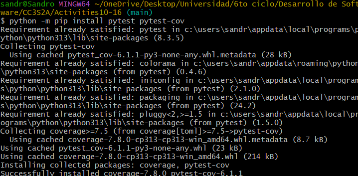
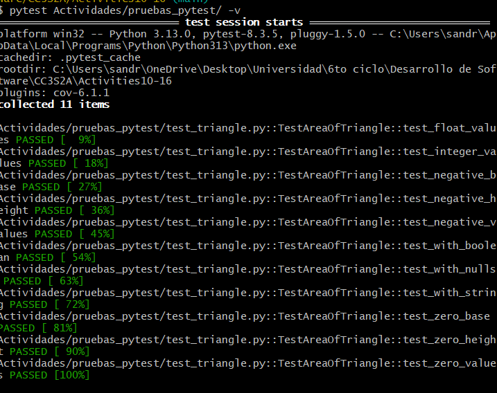
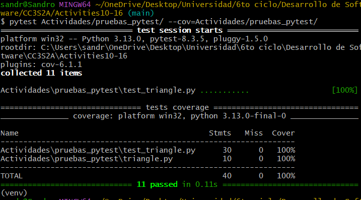
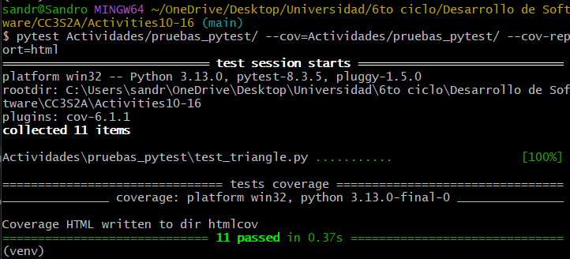
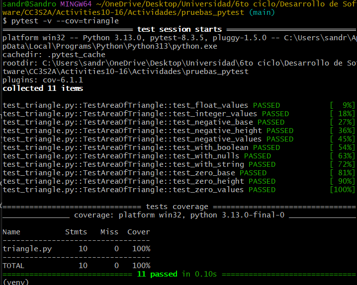
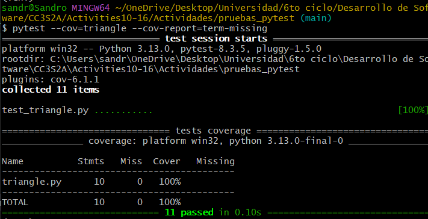
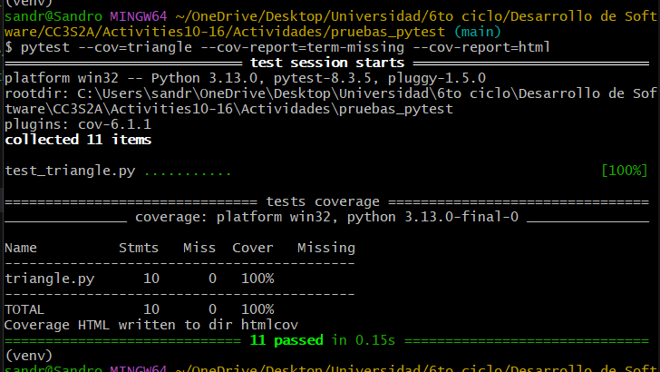
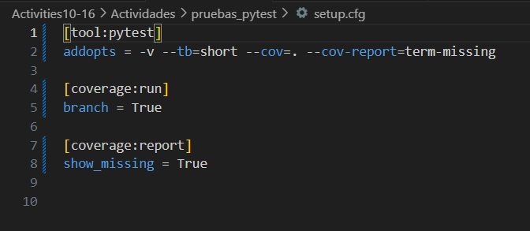
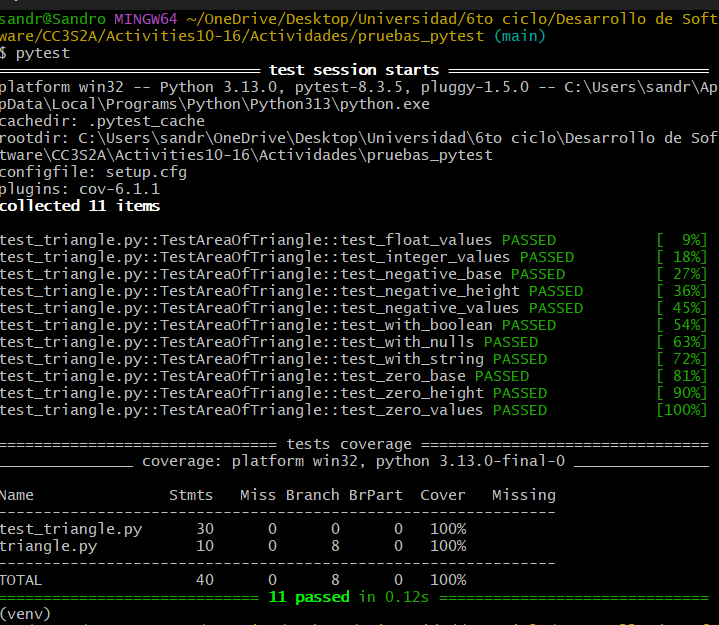

## Instalar pytest y pytest-cov
En un entorno virtual se instalan ambas herramientas

## Correr pytest
Se ejecuta el comando pytest -v poniendo la dirección de la carpeta para así ejecutar todos los tests en esta y obtener información detallada

## Uso de pytest-cov en paquetes
Se ejecuta el commando pytest --cov=Actividades/pruebas_pytest/ en la carpeta para así poder saber la cobertura que tiene cada script del paquete.

Además se tiene una funcionalidad extra que permite guardar el reporte de cobertura en un html, esta se usa de la siguiente manera:

## Uso de pytest-cov en módulos
También se puede hacer pytest en un módulo en específico, como en la siguiente imagen:

Se puede hacer un reporte que muestre las líneas que no estén correctas.

Se puede combinar este reporte con el de html

## Automatización de pytest
Se hace uso de un archivo setup.cfg para automatizar el uso de pytest

Por último, se corre el comando pytest y se verifica que el archivo setup.cfg funciona correctamente.

