# Actividad 6

## Rebase

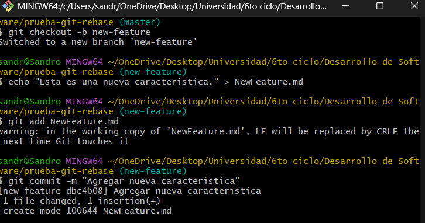

### Log

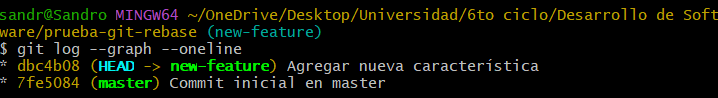

Luego se comprueba la divergencia de las ramas

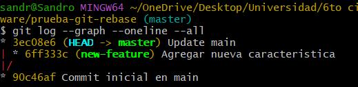

Se hace el rebase

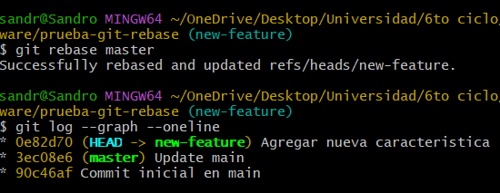

Se hace merge entre las dos ramas
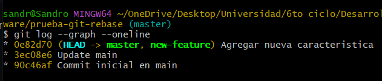

## Cherry-pick

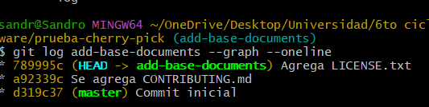

Se realiza el cherry-pick:

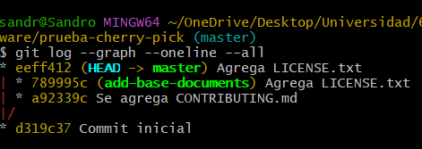

1. **¿Por qué se considera que rebase es más útil para mantener un historial de proyecto lineal en comparación con merge?**  
Pues el el único merge que mantiene un historial lineal es el merge fast forward, sin embargo, lo único que se hace en este es cambiar el puntero de head, el rebase lo que hace es reescribir los commits de la rama a partir de la base nueva, por lo que la historia cambia. Además, el rebase funciona aún si la rama con la que se quiere fusionar ha tenido cambios nuevos después de la base nueva que se quiere aplicar, cosa que no funciona para un merge fast forward.  

2. **¿Qué problemas potenciales podrían surgir si haces rebase en una rama compartida con otros miembros del equipo?**  

 Pueden ocurrir problemas de sincronización, ya que, al cambiar la base de la rama, git puede intentar añadir commits a esta, lo que puede causar un conflicto que afecte el proyecto. Además los demás miembros del equipo van a tener una historia diferente a la de antes y sobre la cuál ya habían trabajdo, esto va a ocasionar que no puedan hacer push, lo que los llevará a realizar modificaciones para resolver estos conflictos.

3. **¿En qué se diferencia cherry-pick de merge, y en qué situaciones preferirías uno sobre el otro?**  

    Merge lo que hace es fusionar dos ramas, en cambio, cherry pick copia commits específicos de una rama a otra. El merge es preferible si quieres aplicar todos los cambios de una rama a la otra, por otro lado, se prefiere hacer cherry pick si solo quieres copiar ciertos commits específicos.

4. **¿Por qué es importante evitar hacer rebase en ramas públicas?**  

    Ya que las ramas públicas son ramas compartidas en equipo es importante evitar hacer rebase para no ocasionar los problemas mencionados en el inciso 2.

## Ejercicios teóricos

1. **Explica la diferencia entre git merge y git rebase y describe en qué escenarios sería más adecuado utilizar cada uno en un equipo de desarrollo ágil que sigue las prácticas de Scrum.**

    En realidad estos comandos hacen cosas totalmente diferentes. Git merge se encarga de fusionar dos ramas, de distintas formas según uses fast forward o no. Git rebase modifica el puntero base de una rama, o, en otras palabras, aplica una cantidad de commits sobre otro. Lo más parecido que hay entre estos es el merge fast forward, ya que ambos mantienen una linealidad en el flujo, sin embargo, la diferencia se centra en que git merge deriva de dos ramas y git rebase modifica una sola, además que los hashes de los commits cambian al hacer git rebase. Se prefiere el git en el caso que estés trabajando un sprint en ramas públicas y todos hayan terminado con su trabajo para no tener conflictos. Por otro lado, es mejor el uso de rebase cuando estás trabajando solo y necesitas un historial más limpio.
2. **¿Cómo crees que el uso de git rebase ayuda a mejorar las prácticas de DevOps, especialmente en la implementación continua (CI/CD)? Discute los beneficios de mantener un historial lineal en el contexto de una entrega continua de código y la automatización de pipeliness**

    En lo que más ayuda el git rebase es en mantener un historial limpio, esto es bastante importante para que sea más fácil evitar distintos tipos de errores en el proceso de CI. Además que mejora la trazabilidad y hace más simples las revisiones PR.
    El beneficio de tener un historial lineal es, simplemente, que es más sencillo leerlo y entenderlo, tener un historial con múltiples ramas fusionadas y que se intersectan unas con otras hace que sea más difícil seguir el flujo de desarrollo.

3. **Un equipo Scrum ha finalizado un sprint, pero durante la integración final a la rama principal (main) descubren que solo algunos commits específicos de la rama de una funcionalidad deben aplicarse a producción. ¿Cómo podría ayudar git cherry-pick en este caso? Explica los beneficios y posibles complicaciones.**

    Justamente lo que hace cherry pick es aplicar unos commits específicos de una rama en otra, entonces esto su uso es totalmente acertado. No es necesario tener que aplicar todos los commits de la rama entera en la otra. Sin embargo, pueden haber complicaciones, en problema dice que es posible aplicar solo algunos commits a producción, si esto no fuera cierto podrían haber conflictos si es que se aplican commits que dependen de otros que no se usarán en el cherry pick. Además, puede ser más difícil seguir el historial de estos commits, ya que ,si es que no se documenta bien, se puede perder la referencia de donde vienen.

## Ejercicios prácticos
1.**Simulación de un flujo de trabajo Scrum con git rebase y git merge** 
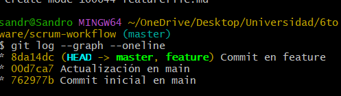

**¿Qué sucede con el historial de commits después del rebase?**

La base de la rama se mueve al último commit en main, por lo que, como se ve en la imagen de arriba, el commit en feature sale después de la actualización en main

**¿En qué situación aplicarías una fusión fast-forward en un proyecto ágil?**

Lo haría cuando quisiera mantener un historial limpio, y por lo tanto mantener sencillo del debug de errores.

2.**Cherry-pick para integración selectiva en un pipeline CI/CD**
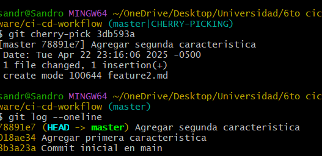

**¿Cómo utilizarías cherry-pick en un pipeline de CI/CD para mover solo ciertos cambios listos a producción?**

Pues lo usaría en el caso que esté trabajando en grupo en una rama, digamos desarrollando una feature, y mis cambios estén listos, sin embargo los cambios de mis compañeros no, entonces iría a la rama main y haría cherry pick de los commits que yo hice para que puedan ser usados, así no afecto el desarrollo de los demás.

**¿Qué ventajas ofrece cherry-pick en un flujo de trabajo de DevOps?**

Más que nada para el avance más rápido del desarrollo. El poder seleccionar commits específicos y evitar el merge hace que se tenga un historial más lineal, además que sirve bastante para corregir errores urgentes sin afectar el desarrollo de otros miembros del equipo.

## Git, scrum y Sprints
### Fase 1:

**¿Por qué es importante trabajar en ramas de funcionalidades separadas durante un sprint?**

Para tener un historial controlado y ordenado, además que se evitan los conflictos de que varios trabajen en un mismo código y permite que se puedan integrar ciertas funcionalidades sin tener que depender de que las otras también estén terminadas.

### Fase 2:
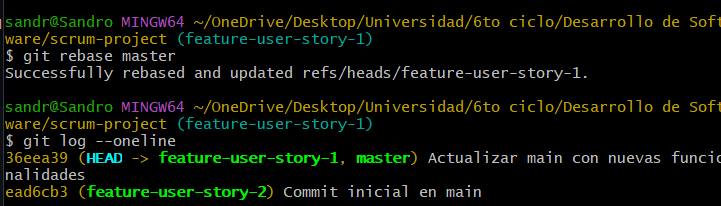

### Fase 3:

**¿Cómo ayuda git cherry-pick a mostrar avances de forma selectiva en un sprint review?**

Te ayuda a aislar la subida de cambios, o sea, si algún avance terminó y los otros en la misma rama no, pues evita el tener que esperar a que todos estén terminando para implementarlos en la rama principal, lo que influye en el hecho de hacer commits frecuentes.

### Fase 4:

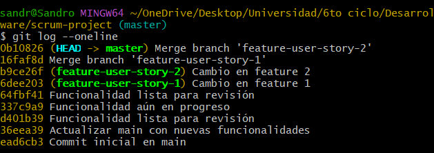

**¿Cómo manejas los conflictos de fusión al final de un sprint? ¿Cómo puede el equipo mejorar la comunicación para evitar conflictos grandes?**

Para evitarlos lo que haría sería comunicarme con los demás miembros del equipo o revisar sus commits para no interferir y generar conflictos. Para manejarlos ya existiendo pues me tocaría igual revisar qué hizo el otro miembro del equipo y comunicarme con él para saber si mantengo mi parte o la suya, o ambas (que es lo que más se haría). El equipo puede mejorar la comunicación mejorando unos buenos mensajes de commits o descripciones, además, en las dailies se pueden comunicar los cambios hechos.

### Fase 5:

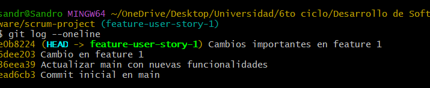

**¿Qué ventajas y desventajas observas al automatizar el rebase en un entorno de CI/CD?**

La ventaja es que se mantiene un historial limpio constantemente, lo que ayuda a diferentes cosas mencionadas anteriormente. La desventaja es que, en ramas colaborativas, esto puede traer muchos problemas o conflictos, lo que puede arruinar la automatización del CI.

## Navegando conflictos y versionado en un entorno devOps

### Ejemplo

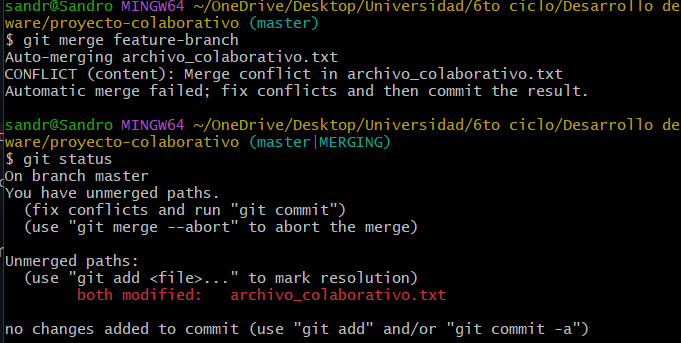

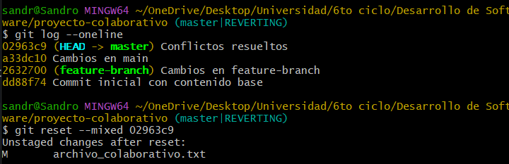

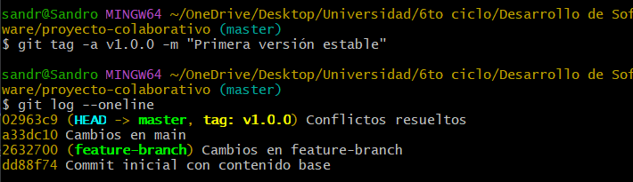

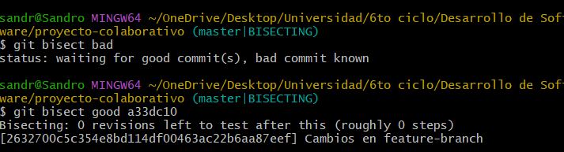

## Preguntas
1. **Ejercicio para git checkout --ours y git checkout --theirs**

   **Contexto**: En un sprint ágil, dos equipos están trabajando en diferentes ramas. Se produce un conflicto de fusión en un archivo de configuración crucial. El equipo A quiere mantener sus cambios mientras el equipo B solo quiere conservar los suyos. El proceso de entrega continua está detenido debido a este conflicto.

   **Pregunta**:  
   ¿Cómo utilizarías los comandos `git checkout --ours` y `git checkout --theirs` para resolver este conflicto de manera rápida y eficiente? Explica cuándo preferirías usar cada uno de estos comandos y cómo impacta en la pipeline de CI/CD. ¿Cómo te asegurarías de que la resolución elegida no comprometa la calidad del código?
   
   **Respuesta**

   Si es que ambos quieren conservar sus cambios, pues no haría uso de ninguno de estos dos comandos, tendría que ir al archivo y combinar ambos cambios manualmente, usando algún merge editor. Si es que solo A quiere conservarlo, pues haría uso de estos comandos para considerar los cambios de A y eliminar los de B, depende de en qué rama estén A y B. La pipeline puede activarse dependiendo de cómo esté configurada, ya que se realiza un commit, y pues seguramente se verificará de que todo esté correcto. La manera más segura de verificar que no se ha comprometido la calidad del código es revisándolo manualmente.  

2. **Ejercicio para git diff**

   **Contexto**: Durante una revisión de código en un entorno ágil, se observa que un pull request tiene una gran cantidad de cambios, muchos de los cuales no están relacionados con la funcionalidad principal. Estos cambios podrían generar conflictos con otras ramas en la pipeline de CI/CD.

   **Pregunta**:  
   Utilizando el comando `git diff`, ¿cómo compararías los cambios entre ramas para identificar diferencias específicas en archivos críticos? Explica cómo podrías utilizar `git diff feature-branch..main` para detectar posibles conflictos antes de realizar una fusión y cómo esto contribuye a mantener la estabilidad en un entorno ágil con CI/CD.

   **Respuesta**
   Justamente usaría ese comando para identificar las diferencias, ya que es mucho más sencillo que cambiar de rama continuamente para ver diferencias entre los archivos. El uso de este comando previene conflictos a la hora de hacer merge, ya que, si es que tienes archivos que han sido modificados en ambas ramas, puedes adaptarlos para que a la hora de hacer merge no se generen conflictos.

3. **Ejercicio para git merge --no-commit --no-ff**

   **Contexto**: En un proyecto ágil con CI/CD, tu equipo quiere simular una fusión entre una rama de desarrollo y la rama principal para ver cómo se comporta el código sin comprometerlo inmediatamente en el repositorio. Esto es útil para identificar posibles problemas antes de completar la fusión.

   **Pregunta**:  
   Describe cómo usarías el comando `git merge --no-commit --no-ff` para simular una fusión en tu rama local. ¿Qué ventajas tiene esta práctica en un flujo de trabajo ágil con CI/CD, y cómo ayuda a minimizar errores antes de hacer commits definitivos? ¿Cómo automatizarías este paso dentro de una pipeline CI/CD?

   **Respuesta**
   Este comando te da los resultados esperados al hacer un merge entre dos ramas, esto ayuda a prevenir conflictos o errores, además que se puede ver cómo tu funcionalidad se integra en la rama principal. En el .yaml haría que el primer paso sea ir a la rama main, el siguiente paso sería hacer uso del comando y lo siguiente hacer tests para saber si hay conflictos o errores.

4. **Ejercicio para git mergetool**

   **Contexto**: Tu equipo de desarrollo utiliza herramientas gráficas para resolver conflictos de manera colaborativa. Algunos desarrolladores prefieren herramientas como vimdiff o Visual Studio Code. En medio de un sprint, varios archivos están en conflicto y los desarrolladores prefieren trabajar en un entorno visual para resolverlos.

   **Pregunta**:  
   Explica cómo configurarías y utilizarías `git mergetool` en tu equipo para integrar herramientas gráficas que faciliten la resolución de conflictos. ¿Qué impacto tiene el uso de `git mergetool` en un entorno de trabajo ágil con CI/CD, y cómo aseguras que todos los miembros del equipo mantengan consistencia en las resoluciones?
   
   **Respuesta**
   Haría que cada uno use el comando git config --global merge.tool e inserte su herramienta gráfica. Esto es bastante importante ya que facilita y agiliza la resolución de conflictos. Mantendría la consistencia quedando de acuerdo con los demás miembros qué herramienta van a usar, o si no, automatizaría el comando que declara el merge tool.

5. **Ejercicio para git reset**

   **Contexto**: En un proyecto ágil, un desarrollador ha hecho un commit que rompe la pipeline de CI/CD. Se debe revertir el commit, pero se necesita hacerlo de manera que se mantenga el código en el directorio de trabajo sin deshacer los cambios.

   **Pregunta**:  
   Explica las diferencias entre `git reset --soft`, `git reset --mixed` y `git reset --hard`. ¿En qué escenarios dentro de un flujo de trabajo ágil con CI/CD utilizarías cada uno? Describe un caso en el que usarías `git reset --mixed` para corregir un commit sin perder los cambios no commiteados y cómo afecta esto a la pipeline.

   **Respuesta**
   La versión soft de este comando se usa cuando solo quieres mover el head sin perder ningún cambio, tanto local como en el staging. La mixed lo que hace es eliminar el commit y eliminar los cambios del staging, por lo que los cambios se quedarían locales sin subirse al repositorio. Si se quiere eliminar por completo el commit junto con los cambios hechos se haría uso de git reset --hard, ya que esto borra todo por completo, hasta localmente. En el caso que se haya subido un cambio que necesita ser modificado nuevamente se hace uso de git reset --mixed, ya que este archivo va a ser modificado de nuevo, por lo tanto no es necesario que esté en el staging.

6. **Ejercicio para git revert**

   **Contexto**: En un entorno de CI/CD, tu equipo ha desplegado una característica a producción, pero se ha detectado un bug crítico. La rama principal debe revertirse para restaurar la estabilidad, pero no puedes modificar el historial de commits debido a las políticas del equipo.

   **Pregunta**:  
   Explica cómo utilizarías `git revert` para deshacer los cambios sin modificar el historial de commits. ¿Cómo te aseguras de que esta acción no afecte la pipeline de CI/CD y permita una rápida recuperación del sistema? Proporciona un ejemplo detallado de cómo revertirías varios commits consecutivos.

   **Respuesta**
    Haría uso de git revert head (si es que se quiere revertir el último commit), así se revierte sin modificar o perder el commit pasado, ya que git hace un commit nuevo con la reversión hecha. Si quiero revertir varios commits consecutivos podría hacer uso de HEAD~n donde n es el número de commits desde el último. Si no puedo hacer uso de git log --oneline para encontrar los hashes de tus commits y así hacer uso de git revert <hash-commit>, <hash-commit>, ..., <hash-commit>

7. **Ejercicio para git stash**

   **Contexto**: En un entorno ágil, tu equipo está trabajando en una corrección de errores urgente mientras tienes cambios no guardados en tu directorio de trabajo que aún no están listos para ser committeados. Sin embargo, necesitas cambiar rápidamente a una rama de hotfix para trabajar en la corrección.

   **Pregunta**:  
   Explica cómo utilizarías `git stash` para guardar temporalmente tus cambios y volver a ellos después de haber terminado el hotfix. ¿Qué impacto tiene el uso de `git stash` en un flujo de trabajo ágil con CI/CD cuando trabajas en múltiples tareas? ¿Cómo podrías automatizar el proceso de *stashing* dentro de una pipeline CI/CD?

   **Respuesta**
   Usaría este comando para evitar conflictos moméntáneamente y así avanzar con las demás responsabilidades, una vez se haya terminado de realizar los demás cambios haría un stash pop y terminaría con mi trabajo anterior.  

8. **Ejercicio para .gitignore**

   **Contexto**: Tu equipo de desarrollo ágil está trabajando en varios entornos locales con configuraciones diferentes (archivos de logs, configuraciones personales). Estos archivos no deberían ser parte del control de versiones para evitar confusiones en la pipeline de CI/CD.

   **Pregunta**:  
   Diseña un archivo `.gitignore` que excluya archivos innecesarios en un entorno ágil de desarrollo. Explica por qué es importante mantener este archivo actualizado en un equipo colaborativo que utiliza CI/CD y cómo afecta la calidad y limpieza del código compartido en el repositorio.

   **Respuesta**
    El gitignore contenería lo siguiente:
    .DS_Store
    Thumbs.db
    *.log
    *.tmp
    .env
    *.local
    config/*.dev.json
    .vscode/

    Depende del proyecto contenería más cosas. Es bastante importante hacer uso de este archivo ya que mantiene previene que ciertos archivos importantes, como el .env, tengan que ser subidos al repositorio.

