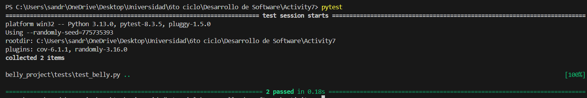

## Ejercicio 1
Se modifica el regex para que acepte lo pedido:

```
    pattern = re.compile(
            r'(?:(\w+)\s*(?:horas?))?\s*(?:(\w+)\s*(?:minutos?))?\s*(?:(\w+)\s*(?:segundos?))?')  

```    

Se crean pruebas unitarias en test_belly.py
```
import pytest
from src.belly import Belly  

belly = Belly()

def test_comer_pepinos_fraccionarios():    
    belly.comer(0.5)
    assert belly.pepinos_comidos == 0.5

```


Se realiza el archivo CI.
```
name: Run Tests

on: [push]

jobs:
  test:
    runs-on: ubuntu-latest

    steps:
    - uses: actions/checkout@v4

    - name: Set up Python
      uses: actions/setup-python@v4
      with:
        python-version: '3.11'

    - name: Install dependencies
      run: |
        pip install -r requirements.txt

    - name: Run Pytest
      run: |
        PYTHONPATH=. pytest

    - name: Run Behave
      run: |
        behave
```

Y se modifica el .feature añadiendo:
```
Escenario: Comer pepinos y esperar en minutos y segundos
  Dado que he comido 35 pepinos
  Cuando espero "1 hora y 30 minutos y 45 segundos"
  Entonces mi estómago debería gruñir
```

## Ejercicio 2
Se modifica el parámetro para que acepte floats
```
@given('que he comido {cukes:f} pepinos')
def step_given_eaten_cukes(context, cukes):
    context.belly.comer(cukes)
```

Se añade lo siguiente al archivo .feature:
```
Escenario: Comer una cantidad fraccionaria de pepinos
  Dado que he comido 0.5 pepinos
  Cuando espero 2 horas
  Entonces mi estómago no debería gruñir
```

Se modifica belly.py para que valide si la cantidad de pepinos es negativa:
``` 
def comer(self, pepinos):
    if pepinos < 0:
        raise ValueError("No se pueden comer una cantidad negativa de pepinos.")
    print(f"He comido {pepinos} pepinos.")
    self.pepinos_comidos += pepinos
```

Se hace añaden las funciones al test para validad los pepinos fraccionarios y negativos:
```
def test_comer_pepinos_fraccionarios():    
    belly.comer(0.5)
    assert belly.pepinos_comidos == 0.5

def test_comer_pepinos_negativos_lanza_error():
    with pytest.raises(ValueError, match="pepinos no puede ser negativa"):
        belly.comer(-3)
```

Y se comprueba en el resultado



Se asegura de que se notifique cualquier fallo en el workflow por correos mediante github, en la configuración de notificaciones.

## Ejercicio 3

Se modificó la regex de tal manera que acepte las palabras "horas", "minutos" y "segundos" en español o en inglés. Además se agregaron keys en inglés al diccionario numeros.

```
numeros = {
    "cero": 0, "uno": 1, "una":1, "dos": 2, "tres": 3, "cuatro": 4, "cinco": 5,
    "seis": 6, "siete": 7, "ocho": 8, "nueve": 9, "diez": 10, "once": 11,
    "doce": 12, "trece": 13, "catorce": 14, "quince": 15, "dieciséis": 16,
    "diecisiete":17, "dieciocho":18, "diecinueve":19, "veinte":20,
    "treinta": 30, "cuarenta":40, "cincuenta":50, "sesenta":60, "setenta":70,
    "ochenta":80, "noventa":90, "media": 0.5,
    "zero": 0, "one": 1, "two": 2, "three": 3, "four": 4, "five": 5,
    "six": 6, "seven": 7, "eight": 8, "nine": 9, "ten": 10, "eleven": 11,
    "twelve": 12, "thirteen": 13, "fourteen": 14, "fifteen": 15,
    "sixteen": 16, "seventeen": 17, "eighteen": 18, "nineteen": 19,
    "twenty": 20, "thirty": 30, "forty": 40, "fifty": 50, "half": 0.5
}

pattern = re.compile(
            r'(?:(\w+)\s*(?:horas?|hours?))?\s*
            (?:(\w+)\s*(?:minutos?|minutes?))?\s*
            (?:(\w+)\s*(?:segundos?|seconds?))?')
```
Además se modifica el archivo ci.yml para que ejecute los escenarios por tag

```
- name: Run Behave
  run: |
    behave --tags=-@english
    behave --tags=@spanish
```

## Ejercicio 4
Para esto, en los steps, se añadó un nuevo regex y, usando random, se generó un número aleatorio entre las dos horas propuestas.

```
aleatorio_pattern = re.compile(r'entre (\w+(?:\.\w+)?)\s*(\w+(?:\.\w+)?) horas?')
```

Se implementó el siguiente escenario:
```
@spanish
Escenario: Comer pepinos y esperar un tiempo aleatorio
  Dado que he comido 15 pepinos
  Cuando espero "entre 2 y 5 horas"
  Entonces mi estómago debería gruñir
```

Además, se usó random.seed(21) para tener aleatoriedad fija.

## Ejercicio 5

Se actualizó las validaciones que se tenían en belly.py

```
def comer(self, pepinos):
      pepinos = float(pepinos)
      if pepinos < 0 or pepinos > 100:
          raise ValueError("No se puede comer una cantidad de pepinos menor que cero ni mayor que 100.")
      print(f"He comido {pepinos} pepinos.")
      self.pepinos_comidos += pepinos
```

Se añaden los siguientes escenarios en belly.feature
```
  @spanish
  Escenario: Manejar una cantidad negativa de pepinos
  Dado que he comido -5 pepinos
  Entonces debería ocurrir un error de cantidad negativa.

  @spanish
  Escenario: Comer una cantidad de pepinos mayor a 100
    Dado que he comido 101 pepinos
    Cuando espero 2 horas
    Entonces debería ocurrir un error de cantidad excesiva.
```

## Ejercicio 6

Se cambia el límite de pepinos en belly.py y además se agrega un escenario gherkin

```
def comer(self, pepinos):
    pepinos = float(pepinos)
    if pepinos < 0 or pepinos > 10000:
        raise ValueError("No se puede comer una cantidad de pepinos menor que cero ni mayor que 100.")
    print(f"He comido {pepinos} pepinos.")
    self.pepinos_comidos += pepinos
```

```
  @spanish
  Escenario: Comer 1000 pepinos y esperar 10 horas
    Dado que he comido 1000 pepinos
    Cuando espero 10 horas
    Entonces mi estómago debería gruñir
```

## Ejercicio 7

En belly_steps.py ya se tiene lo del uso de la "y" y la coma cubierto

```
ef step_when_wait_time_description(context, time_description):
    time_description = time_description.strip('"').lower()
    time_description = time_description.replace(',', ' ')
    time_description = time_description.replace(' and ', ' ')
    time_description = time_description.replace(' y ', ' ')
    time_description = time_description.strip()
```

## Ejercicio 8
Se añade una nueva función a test_belly.py y además se añade un escenario en gherkin.

```
def test_estomago_gruñe_si_se_cumplen_condiciones():
    belly = Belly()
    belly.comer(12)
    belly.esperar(2)
    assert belly.esta_gruñendo()
```

Escenario Gherkin:
```
Escenario: Comer muchos pepinos y esperar el tiempo suficiente
  Dado que he comido 12 pepinos
  Cuando espero 2 horas
  Entonces mi estómago debería gruñir
```

## Ejercicio 9

Con la historia de usuario se escribe el siguiente escenario Gherkin

```
  @spanish @historia_usuario
  Escenario: Comer suficientes pepinos y esperar el tiempo adecuado
    Dado que he comido 20 pepinos
    Cuando espero 2 horas
    Entonces mi estómago debería gruñir

  @spanish @historia_usuario
  Escenario: Comer pocos pepinos y esperar mucho tiempo
    Dado que he comido 5 pepinos
    Cuando espero 3 horas
    Entonces mi estómago no debería gruñir

  @spanish @historia_usuario
  Escenario: Comer suficientes pepinos pero esperar poco tiempo
    Dado que he comido 30 pepinos
    Cuando espero 1 hora
    Entonces mi estómago no debería gruñir
```

## Ejercicio 10

