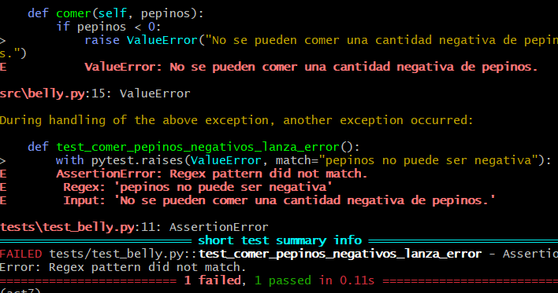

## Ejercicio 1
Se modifica el regex para que acepte lo pedido:

```
r'(?:(\w+)\s*(?:horas?|hrs?|h))?\s*' 
r'(?:(\w+)\s*(?:minutos?|mins?|m))?\s*'  
r'(?:(\w+)\s*(?:segundos?|segs?|s))?'  

```    


Se realiza el archivo CI.
```name: Run Tests

on: [push]

jobs:
  test:
    runs-on: ubuntu-latest

    steps:
    - uses: actions/checkout@v4

    - name: Set up Python
      uses: actions/setup-python@v4
      with:
        python-version: '3.11'

    - name: Install dependencies
      run: |
        pip install -r requirements.txt

    - name: Run Pytest
      run: |
        PYTHONPATH=. pytest

    - name: Run Behave
      run: |
        behave
```

Y se modifica el .feature añadiendo:
```
Escenario: Comer pepinos y esperar en minutos y segundos
  Dado que he comido 35 pepinos
  Cuando espero "1 hora y 30 minutos y 45 segundos"
  Entonces mi estómago debería gruñir
```

## Ejercicio 2
Se modifica el parámetro para que acepte floats
```
@given('que he comido {cukes:f} pepinos')
def step_given_eaten_cukes(context, cukes):
    context.belly.comer(cukes)
```

Se añade lo siguiente al archivo .feature:
```
Escenario: Comer una cantidad fraccionaria de pepinos
  Dado que he comido 0.5 pepinos
  Cuando espero 2 horas
  Entonces mi estómago no debería gruñir
```

Se modifica belly.py para que valide si la cantidad de pepinos es negativa:
``` 
def comer(self, pepinos):
    if pepinos < 0:
        raise ValueError("No se pueden comer una cantidad negativa de pepinos.")
    print(f"He comido {pepinos} pepinos.")
    self.pepinos_comidos += pepinos
```

Se hace añaden las funciones al test para validad los pepinos fraccionarios y negativos:
```
def test_comer_pepinos_fraccionarios():    
    belly.comer(0.5)
    assert belly.pepinos_comidos == 0.5

def test_comer_pepinos_negativos_lanza_error():
    with pytest.raises(ValueError, match="pepinos no puede ser negativa"):
        belly.comer(-3)
```

Y se comprueba en el resultado



Se añade la siguiente línea a ci.yml para mandar mensaje en caso haya algún error:
```   
    - name: Notify failure
      if: failure()
      run: |
        echo "Tests failed!"
        exit 1
```

## Ejercicio 3